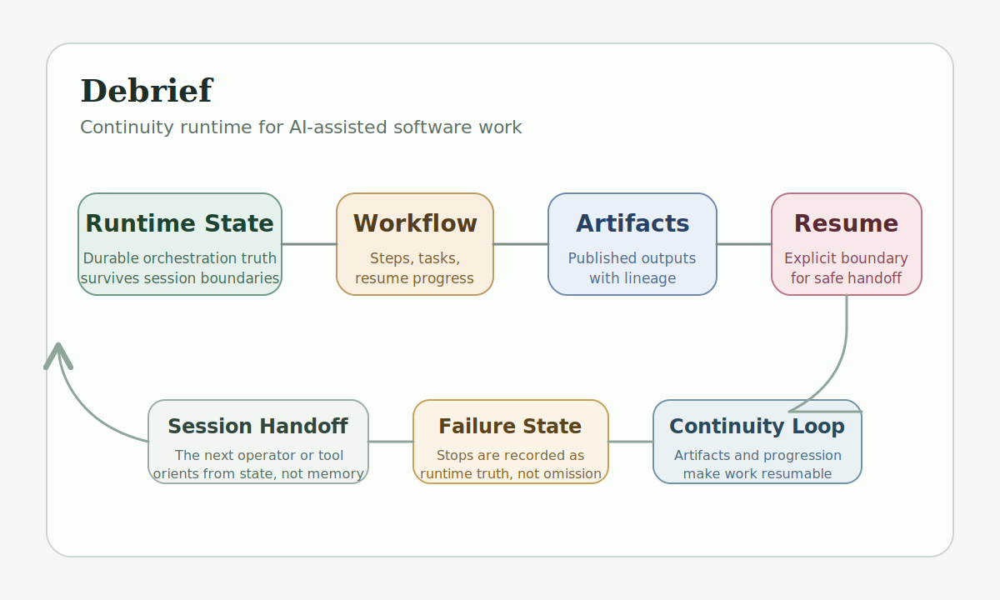

# Debrief
## Continuity Runtime for AI-Assisted Software Work

Debrief is a stateful runtime for supervised AI-assisted software work.

Its purpose is to preserve durable orchestration truth across sessions, workflows, tools, and handoffs. It is not a prompt wrapper, not a governance engine, and not a generic swarm framework. It is a runtime model for keeping work coherent over time.

Debrief is developed within the broader AI Work Systems private workspace. This public repository presents Debrief as the public-facing identity for the continuity-runtime portion of that work, while acknowledging the surrounding context where it helps explain architectural boundaries.

> Private implementation repository. This public repository is a documentation-first technical overview of the runtime model, workflow framing, and current implementation direction.



## Why This Project Exists

AI-assisted software work breaks down when continuity depends on memory.

The pattern is familiar:

- a session ends
- context is lost
- the next tool or agent restarts from fragments
- architecture intent drifts
- runtime state, docs, and implementation fall out of alignment

Debrief exists to make continuity explicit instead of incidental.

Its central claim is that orchestration truth should live in durable, inspectable runtime state rather than being reconstructed from chat history, prompt habit, or operator memory.

## Core Thesis

Debrief should be authoritative for orchestration state over time.

That means it should be able to answer:

- what workflow is running
- what state the workflow is in
- what artifacts exist
- what failed
- where execution stopped
- what boundary can safely resume next

The system is intentionally designed around explicit runtime semantics rather than UI flow or provider-specific abstractions.

## What Makes It Distinct

### Durable orchestration truth

Runtime truth should survive session boundaries. The system should not depend on a live process or conversational continuity in order to explain what happened and what should happen next.

### Resumability through explicit boundaries

Resuming work safely requires more than "continue where we left off." Debrief treats resume points as explicit runtime boundaries backed by authoritative artifacts and known workflow progression.

### Artifact lineage, not just outputs

The runtime is concerned not only with final outputs, but with the lineage of inputs, intermediate artifacts, transitions, and failures that make those outputs trustworthy and resumable.

### Runtime first, workflow second

Debrief should be understood as a runtime with workflows, not a single-purpose repository-analysis tool that happens to persist state.

### Honest implementation slices

The implementation discipline behind Debrief favors narrow slices that can be claimed, inspected, and resumed truthfully rather than broad architectures that overstate completion.

## Architecture At A Glance

```text
Debrief Runtime
    ->
Workflow
    ->
Artifacts, State, Resume Boundaries
```

In that model:

- the runtime owns durable run state
- the runtime owns workflow progression
- the runtime owns artifact publication
- the runtime owns failure recording
- the workflow owns workflow-local semantics

That separation matters because it keeps orchestration authority distinct from workflow-specific logic.

## Workspace Context

Debrief lives inside a broader body of work concerned with governed, continuous, AI-assisted implementation.

Within that broader context:

- Debrief focuses on runtime continuity and orchestration truth
- Proof-of-Care focuses on governed action boundaries for autonomous agents
- PACE focuses on planning, audit, handoff, and implementation closure discipline

These systems are related, but not interchangeable. Debrief is the continuity runtime, and this repository is the public-facing overview of that layer.

## Repository Guide

This overview repository is organized to make the runtime legible without exposing the private implementation:

- `docs/overview.md`: project framing and continuity problem definition
- `docs/runtime-model.md`: runtime responsibilities and authoritative state
- `docs/workflow-model.md`: workflow identity, progression, and resume boundaries
- `docs/artifact-lineage.md`: how artifacts become trustworthy and usable over time
- `docs/continuity-and-handoffs.md`: continuity across sessions, operators, and agents
- `docs/workspace-relationships.md`: relationship to the surrounding private workspace
- `docs/public-positioning.md`: concise public-facing positioning and shareable summary copy
- `docs/status.md`: current scope, maturity, and limitations
- `examples/`: sanitized examples of run and artifact surfaces

## Current Scope

Debrief is best framed today as a continuity runtime being built through narrow, honest implementation slices.

Current emphasis includes:

- durable runtime state
- explicit workflow identity
- step and task progression
- authoritative artifact publication
- safe resume boundaries
- continuity across sessions and handoffs

Its current workflow focus is repository analysis, but the runtime model is broader than a single analysis pipeline.

## Public Boundary

This repository does not publish:

- the full private codebase
- internal repository-service implementation details
- provider credentials or environment setup
- raw internal state files
- private workflow notes
- internal build history that would reveal the full private surface

The goal is architectural clarity, not a partial code leak.

## Audience

This repository is intended for:

- recruiters evaluating continuity and orchestration thinking
- technical reviewers interested in runtime semantics
- collaborators building AI-assisted engineering systems
- teams exploring better handoff, resumability, and runtime coherence

## Available On Request

Additional architecture walkthroughs, runtime discussion, and selected sanitized artifacts are available on request.
